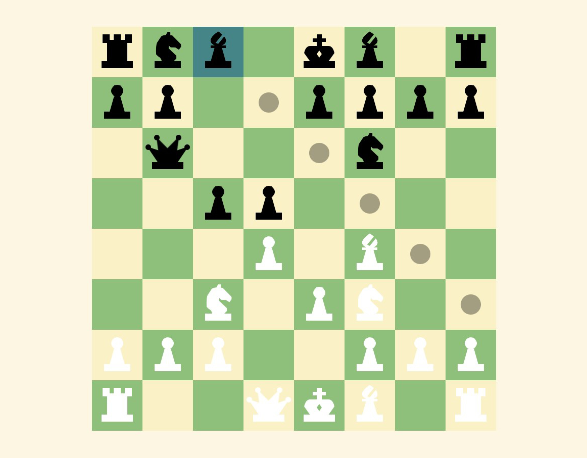

# Battle Chess

by: Kevin from Brooklyn Technical High School

Chess game remake with a GUI for MP3 school project.

The GUI includes features like highlighting all possible moves, detecting checks on the king, highlighting the current piece, audio feedback on piece move, and more.

All sprites, pictures, including the logo, and sounds are made from scratch.

## How To Play

### Pawns

- Pawns can move only 1 space forward as long as that space is unobstructed.
- Pawns can attack diagonally only if there is an enemy piece there.
- On their first move, a pawn can move 2 squares instead of 1. However, another pawn can diagonally capture the square behind the pawn, and take the pawn with it. This is called "En Passant."
  
### Bishops

- Bishops can move diagonally, in an X pattern. It can capture enemy pieces but cannot move through pieces.

### Rooks

- Rooks can move vertically and horizontally, in a + pattern. It can capture enemy pieces but cannot move through pieces.
  
### Knights

- Knights can move in a direction 2 squares and in the perpendicular direction 1 square. A knight may jump over both enemy and friendly pieces, but can only take enemy pieces.
  
### Queens

- Queens have the combined functionality of both a Bishop and a Rook.

### King

- A king can move 1 square in all 8 directions. 
- The king is the most important piece on the board and determines the winner and loser of the game.
- A king is in check if there is an enemy piece attacking the king. You cannot voluntarily put your king in check.
- When the king is in check, you must get the king out of check, either by moving the king or blocking with another piece. If you are unable to move the king out of check, you are in a "checkmate," and you lose the game.
- If you are unable to move at all, but your king is not in check, you are in a stalemate. Nobody wins, and it is a draw.
  
## How The Game Works
  